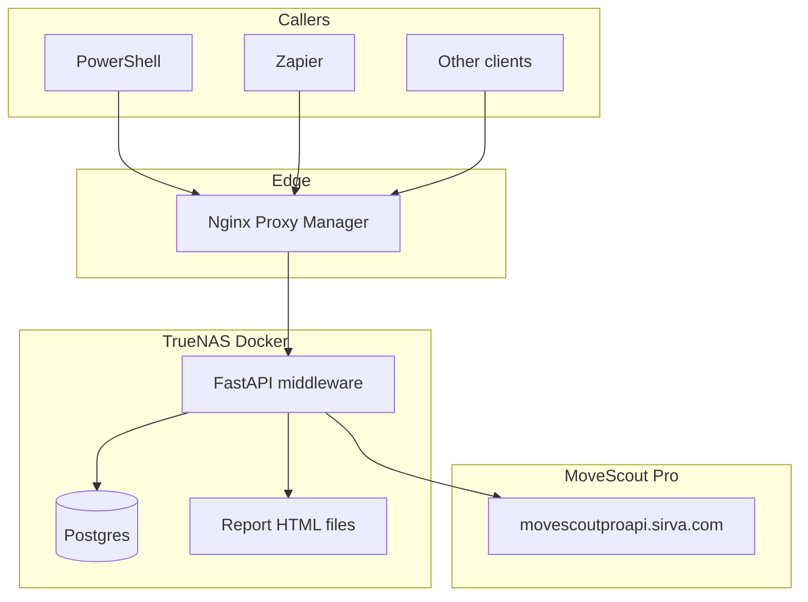
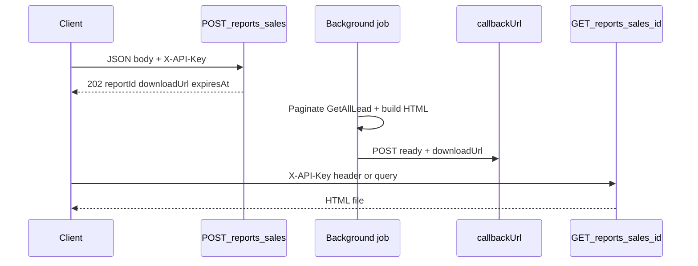

# MoveScout Middleware API

REST proxy for [MoveScout Pro](https://movescoutpro.sirva.com). External tools (PowerShell, Zapier, custom apps) call **this** API with an `X-API-Key`. The middleware stores each caller’s MoveScout credentials, manages OAuth-style tokens, and forwards requests to the MoveScout Pro API (`movescoutproapi.sirva.com`).

**Production example:** `https://mspapi.jbeckstead.com`

---

## Table of contents

1. [Why this exists](#why-this-exists)
2. [Architecture](#architecture)
3. [Authentication](#authentication)
4. [API surface](#api-surface)
5. [Sales performance reports](#sales-performance-reports)
6. [Leads enriched export](#leads-enriched-export)
7. [Configuration](#configuration)
8. [Deployment (TrueNAS)](#deployment-truenas)
9. [Private GitHub repo + SSH deploy key](#private-github-repo--ssh-deploy-key)
10. [Upgrades and operations](#upgrades-and-operations)
11. [Admin scripts](#admin-scripts)
12. [Development](#development)
13. [Project layout](#project-layout)
14. [Further reading](#further-reading)

---

## Why this exists

MoveScout Pro’s API is designed for their web app: session tokens, Kendo-style filters, multi-step estimate/inventory flows, and paginated `GetAllLead` calls. This middleware:

- Exposes a **stable REST surface** with API-key auth for automation
- **Caches MoveScout tokens** per user (24h, refresh buffer) so callers don’t handle login
- **Encrypts MoveScout passwords** at rest in Postgres
- Adds **hero endpoints** (inventory, pricing, sales reports) that combine many upstream calls into one middleware request
- Runs as **Docker Compose** on TrueNAS (Postgres + API) behind nginx/NPM

Callers never send MoveScout username/password after initial user setup—only `X-API-Key`.

---

## Architecture



**Request path (typical):**

1. Client sends `X-API-Key` to middleware
2. Middleware resolves `User` row, decrypts MoveScout password if needed, obtains/refreshes `accessToken`
3. Middleware calls MoveScout with correct headers (`Origin`, `User-Agent`, bearer token)
4. Response is transformed (JSON, CSV, HTML, or file download) and returned

**Stack:**

| Component | Role |
|-----------|------|
| **FastAPI** | HTTP API, routing, validation |
| **Postgres** | Users, API key hashes, encrypted MoveScout creds, token cache, audit log, report job metadata |
| **Alembic** | Schema migrations |
| **Docker Compose** | `postgres` + `api` services |
| **nginx / NPM** | TLS termination, reverse proxy to port 8000 |

---

## Authentication

### Middleware (callers → this API)

Every route except `GET /health` requires:

```http
X-API-Key: <your-api-key>
```

Each **User** in Postgres has:

- `api_key_hash` — bcrypt hash of the issued key (plain key shown once at creation)
- `movescout_username` / `movescout_password_enc` — Fernet-encrypted MoveScout login
- Optional `sales_rep_name` — used by named queries like `GET /queries/my-leads`

Create users with [`scripts/create_user.py`](scripts/create_user.py). Rotate keys with [`scripts/rotate_api_key.py`](scripts/rotate_api_key.py).

### MoveScout (middleware → Sirva)

Handled internally by [`app/services/movescout_service.py`](app/services/movescout_service.py):

- `POST /api/TokenAuth/Authenticate` when no valid cached token
- Token stored in `token_cache` with expiry
- On upstream `401`, token is invalidated and refreshed automatically

Callers **never** pass MoveScout tokens.

### Report download (URL fetch / Zapier)

`GET /reports/sales/{reportId}` accepts the API key as:

- Header: `X-API-Key: ...` (normal), or
- Query param: `?X-API-Key=...` (for URL-based attachment fetch in Zapier)

Same key as POST; no separate download token.

---

## API surface

All routes require `X-API-Key` unless noted. OpenAPI docs: `/docs` when `DISABLE_PUBLIC_DOCS=false`.

### Health

| Method | Path | Description |
|--------|------|-------------|
| GET | `/health` | Liveness check (**no auth**) |

### List of values & reference data

Cached per API user (TTL configurable).

| Method | Path | Description |
|--------|------|-------------|
| GET | `/lov` | MoveScout list-of-value enums (`?refresh=true` bypasses cache) |
| GET | `/reference/service-items` | Alliance item master |
| GET | `/reference/service-item-types` | Alliance item types |
| GET | `/reference/service-item-categories` | Alliance categories |
| GET | `/reference/vehicles` | Auto make/model reference |
| GET | `/reference/transit-seasons` | Transit guide seasons |
| GET | `/reference/agents` | All Sirva network agents (`Dropdown/GetAllAgentList`) |
| GET | `/reference/price-classes` | Alliance price classes (`?bookerId=`) |

### Leads

Client-driven pagination: call **page-count** first, then fetch pages. CSV export loads all pages server-side.

| Method | Path | Description |
|--------|------|-------------|
| GET | `/leads/page-count` | Probe `totalCount` + `pageCount` |
| GET | `/leads` | One page (`page`, `maxResultSize`, `filter`, …) |
| GET | `/leads/export` | Full CSV export |
| GET | `/leads/{id}` | Single lead |
| POST | `/leads` | Create lead |
| PUT | `/leads/{id}` | Update (fetch → merge → write) |
| POST | `/leads/query/page-count` | Page count for POST body filters |
| POST | `/leads/query` | One page or CSV (`export=true`) |

MoveScout pagination uses `skipCount` + `maxResultCount`, not a `page` field upstream—the middleware maps `page` for callers.

**Filterable fields** include: `agencyCode`, `dispositionId`, `moveTypeId`, `salesRepName`, `creationTime`, `registrationNumber`, name/location fields, etc. See [`docs/movescout-api-catalog.md`](docs/movescout-api-catalog.md).

### Inventory & estimates (hero + pass-through)

| Method | Path | Description |
|--------|------|-------------|
| GET | `/leads/{id}/inventory` | **Hero:** primary estimate + room-grouped inventory |
| GET | `/leads/{id}/pricing` | **Hero:** primary estimate + pricing JSON |
| GET | `/leads/{id}/estimates` | List estimates |
| GET | `/leads/{id}/estimates/primary` | Primary estimate summary |
| GET | `/leads/{id}/estimates/{estimateId}` | Full estimate DTO |
| GET | `/leads/{id}/estimates/{estimateId}/summary` | Room/segment totals |
| GET | `/leads/{id}/estimates/{estimateId}/rooms` | Room list |
| GET | `/leads/{id}/estimates/{estimateId}/segments` | Segments |
| GET | `/leads/{id}/estimates/{estimateId}/accessorials` | Accessorials |
| GET | `/leads/{id}/estimates/{estimateId}/pricing` | Pricing engine response |
| GET | `/leads/{id}/estimates/{estimateId}/tariffs` | Tariffs |
| GET | `/leads/{id}/estimates/{estimateId}/auto-spot` | Auto spot |
| GET | `/leads/{id}/estimates/{estimateId}/notes` | Customer notes |
| GET | `/leads/{id}/estimates/{estimateId}/alliance` | Alliance quote |
| GET | `/leads/{id}/estimates/{estimateId}/booker-id` | Booker/agency ID |

### Appointments

| Method | Path | Description |
|--------|------|-------------|
| GET | `/leads/{id}/appointments` | Appointments for a lead |
| POST | `/leads/{id}/appointments` | Create survey appointment |
| GET | `/appointments` | Cross-lead activity search |
| GET | `/appointments/latest-per-lead` | Latest activity per lead |

### Named queries

Pre-built filters (booked-no-reg, scheduled surveys, unassigned, my-leads).

| Method | Path | Description |
|--------|------|-------------|
| GET | `/queries/booked-no-reg` | Booked leads without reg number |
| GET | `/queries/scheduled-surveys` | Survey scheduled |
| GET | `/queries/unassigned` | Unassigned qualified leads |
| GET | `/queries/my-leads` | Leads for user’s `sales_rep_name` |

### Reports

See [Sales performance reports](#sales-performance-reports).

| Method | Path | Description |
|--------|------|-------------|
| POST | `/reports/sales` | Enqueue async report job → **202** |
| GET | `/reports/sales/{reportId}` | Download HTML or poll status |

---

## Sales performance reports

Bailey’s **Interstate sales performance HTML report** (weekly rep metrics, closing rates, disposition buckets). Generation runs **in the background** so HTTP/proxy timeouts are not an issue.

### Flow



### Step 1 — Enqueue (`POST /reports/sales`)

**Content-Type:** `application/json`

| Field | Default | Notes |
|-------|---------|-------|
| `moveType` | `Interstate` | Also filtered upstream via `moveTypeId` |
| `start` | Jan 1 of current year | MoveScout date format, e.g. `Jan 1, 2026` |
| `end` | Today | e.g. `May 29, 2026` |
| `location` | Bailey's Moving & Storage | Report header only |
| `goal` | `0.40` | Closing rate goal (0–1) |
| `salesRepName` | (none) | Optional `contains` filter on leads |
| `defaultFilter` | `3` | Maps to MoveScout `defaultFilterLead` |
| `callbackUrl` | (none) | **Per-client** webhook URL; notified when job completes |

**Response 202:**

```json
{
  "reportId": "uuid",
  "status": "pending",
  "expiresAt": "2026-05-30T22:00:00Z",
  "downloadUrl": "https://mspapi.jbeckstead.com/reports/sales/uuid"
}
```

### Step 2 — Webhook (optional)

When the job finishes, if `callbackUrl` was provided, the middleware **POSTs JSON**:

```json
{
  "reportId": "uuid",
  "status": "ready",
  "downloadUrl": "https://mspapi.jbeckstead.com/reports/sales/uuid",
  "expiresAt": "...",
  "filename": "sales-interstate-20260530.html",
  "error": null
}
```

On failure, `status` is `"failed"` and `downloadUrl` is `null`; `error` has the message.

Optional env `REPORT_CALLBACK_SECRET` sends `Authorization: Bearer ...` on outbound webhooks.

### Step 3 — Download (`GET /reports/sales/{reportId}`)

| Status | Meaning |
|--------|---------|
| **200** | HTML file (`Content-Disposition` attachment) |
| **409** | Still `pending` / `running` (JSON body) |
| **404** | Unknown id or wrong user |
| **410** | Expired (default TTL 1 hour) |
| **500** | Job failed (JSON with error) |

**Zapier email attachment:** use URL with query-param auth:

```text
{{downloadUrl}}?X-API-Key=YOUR_KEY
```

### PowerShell example

```powershell
$body = @{
  moveType = "Interstate"
  start = "Jan 1, 2026"
  end = "May 29, 2026"
  callbackUrl = "https://your-flow.webhook.office.com/..."
} | ConvertTo-Json

$job = Invoke-RestMethod -Method POST `
  -Uri "https://mspapi.jbeckstead.com/reports/sales" `
  -Headers @{ "X-API-Key" = $apiKey; "Content-Type" = "application/json" } `
  -Body $body

# Download (or let Zapier use downloadUrl + ?X-API-Key=)
Invoke-WebRequest `
  -Uri "$($job.downloadUrl)?X-API-Key=$apiKey" `
  -OutFile "report.html"
```

### Report storage

| What | Where |
|------|--------|
| Job metadata (`status`, params, paths) | Postgres `report_jobs` table |
| HTML files | Disk (`REPORT_STORAGE_DIR`, default `/tmp/movescout-reports`) |
| Expiry | `REPORT_TTL_SECONDS` (default 3600); background sweeper every 15 min |

Requires migration: `alembic upgrade head` (revision `002_report_jobs`).

---

## Leads enriched export

Standalone script for **sales analysis**: one wide CSV row per qualified lead, with all GetAllLead fields plus primary-estimate pricing summary columns (Shape A). Downstream tools (pandas, Excel, Power BI) can answer questions like booked rate by rep, average line haul, packing uptake, and selected valuation.

### Usage

```bash
python scripts/export_leads_enriched.py \
  --api-key YOUR_KEY \
  --base-url https://mspapi.jbeckstead.com \
  --start 2026-01-01 \
  --end 2026-05-29 \
  --output leads_enriched_jan-may-2026.csv
```

| Flag | Default | Description |
|------|---------|-------------|
| `--start` / `--end` | (required) | `creationTime` range (`YYYY-MM-DD` or `Jan 1, 2026`) |
| `--default-filter` | `3` | Qualified leads only (`defaultFilterLead`) |
| `--page-size` | `500` | Lead list pagination (max 1000) |
| `--concurrency` | `8` | Parallel `GET /leads/{id}/pricing` calls |
| `--timeout` | `120` | HTTP read timeout (seconds) |
| `--retries` | `3` | Retries on 502/503/timeout |

Environment variables: `MSPAPI_KEY`, `MSPAPI_BASE_URL`.

### Output columns

- **All lead fields** from GetAllLead, with LOV-resolved `*Name` fields filled where IDs are present
- **Pricing metadata:** `hasPrimaryEstimate`, `estimateId`, `estimateName`, `pricingFetchError`
- **Category net totals:** `totalTransportationNet`, `totalPackingNet`, `totalContainersNet`, etc.
- **Sub-fields:** `lineHaulNet`, `totalWeight`, `smfPercentage`, `selectedValuation`, `totalEstimatePriceNet`
- **Dynamic columns:** if an estimate exposes an unknown `*Net` field, a new `total…Net` column is added for the whole file

### Null vs zero

| Situation | Pricing cells |
|-----------|----------------|
| No primary estimate | **Empty** (null) — `hasPrimaryEstimate=false` |
| Has estimate, category absent or zero | **`0`** |

This keeps averages honest: null means “no quote,” zero means “quoted at $0.”

### Runtime

Expect **minutes** for thousands of leads (one pricing call per lead). Progress logs to stderr every 50 pricing fetches. A JSON summary (row counts, elapsed time) prints when complete.

Logic lives in [`app/reports/pricing_summary.py`](app/reports/pricing_summary.py); orchestration in [`scripts/export_leads_enriched.py`](scripts/export_leads_enriched.py).

---

## Configuration

Copy [`.env.example`](.env.example) to `.env`. Key variables:

| Variable | Purpose |
|----------|---------|
| `DATABASE_URL` | Postgres connection (async) |
| `ENCRYPTION_KEY` | Fernet key for MoveScout passwords (**required**) |
| `MOVESCOUT_BASE_URL` | API host (default `movescoutproapi.sirva.com`) |
| `MOVESCOUT_ORIGIN` | Browser origin header (default `movescoutpro.sirva.com`) |
| `ENVIRONMENT` | `production` disables verbose errors |
| `DISABLE_PUBLIC_DOCS` | `true` hides `/docs` in prod |
| `RATE_LIMIT_PER_MINUTE` | Per API key (default 60) |
| `API_PUBLIC_BASE_URL` | **Required in prod** for absolute `downloadUrl` in webhooks |
| `REPORT_TTL_SECONDS` | Report file lifetime (default 3600) |
| `REPORT_MAX_LEADS` | Optional cap; job fails if probe exceeds |
| `REPORT_CALLBACK_SECRET` | Optional Bearer token on outbound webhooks |

Generate encryption key:

```bash
python -c "from cryptography.fernet import Fernet; print(Fernet.generate_key().decode())"
```

---

## Deployment (TrueNAS)

**Recommended guide:** [deploy/TRUENAS-CUSTOM-APP.md](deploy/TRUENAS-CUSTOM-APP.md)

Summary:

1. Dataset with git clone (e.g. `/mnt/RJMSA_Nas/movescout-api` or `/mnt/tank/apps/movescout-api`)
2. `.env` with production secrets + `API_PUBLIC_BASE_URL`
3. Custom App via YAML → `deploy/truenas-compose.yml`
4. `alembic upgrade head` + `create_user.py`
5. Nginx Proxy Manager → proxy to TrueNAS `:8000`, TLS

Production `.env` minimum:

```env
ENVIRONMENT=production
DISABLE_PUBLIC_DOCS=true
ENCRYPTION_KEY=<fernet-key>
POSTGRES_PASSWORD=<strong-password>
API_PUBLIC_BASE_URL=https://mspapi.jbeckstead.com
```

Firewall: allow **443 → NPM only**; block WAN → 8000; allow outbound HTTPS to Sirva.

---

## Private GitHub repo + SSH deploy key

If the repo is **private**, TrueNAS needs a **read-only deploy key** for `git pull`.

### One-time setup (TrueNAS shell)

```bash
# Generate key
ssh-keygen -t ed25519 -C "truenas-movescout-api-deploy" \
  -f ~/.ssh/movescout_api_deploy -N ""

# SSH config
mkdir -p ~/.ssh && chmod 700 ~/.ssh
cat >> ~/.ssh/config << 'EOF'
Host github.com
  HostName github.com
  User git
  IdentityFile ~/.ssh/movescout_api_deploy
  IdentitiesOnly yes
EOF
chmod 600 ~/.ssh/config
ssh-keyscan github.com >> ~/.ssh/known_hosts

# Show public key → add to GitHub repo Settings → Deploy keys (read-only)
cat ~/.ssh/movescout_api_deploy.pub

# Test
ssh -T git@github.com

# Ensure remote is SSH
cd /mnt/RJMSA_Nas/movescout-api   # your path
git remote set-url origin git@github.com:tkdlax/movescout-api.git
git pull
```

Then make the repo private on GitHub; `git pull` should still work.

---

## Upgrades and operations

```bash
cd /mnt/RJMSA_Nas/movescout-api   # your dataset path
git pull

docker compose -f deploy/docker-compose.yml -f deploy/docker-compose.prod.yml up -d --build
docker compose -f deploy/docker-compose.yml run --rm api alembic upgrade head
```

Redeploy/restart the Custom App in TrueNAS UI if needed.

**Postgres backup:**

```bash
docker compose -f deploy/docker-compose.yml exec postgres \
  pg_dump -U movescout movescout | gzip > backup_$(date +%Y%m%d).sql.gz
```

**Restore:**

```bash
gunzip -c backup.sql.gz | docker compose -f deploy/docker-compose.yml exec -T postgres \
  psql -U movescout movescout
```

---

## Admin scripts

```bash
# Create API user (prints X-API-Key once)
docker compose -f deploy/docker-compose.yml run --rm api python scripts/create_user.py \
  --name "Admin" \
  --movescout-username "user@example.com" \
  --movescout-password "secret" \
  --sales-rep-name "Your Name"

# Rotate API key
python scripts/rotate_api_key.py --user-id "<uuid>"

# Smoke-test inventory hero endpoint
python scripts/test_inventory_by_lead.py --lead-id 1553516 --api-key YOUR_KEY

# Export leads enriched with primary-estimate pricing (Shape A wide CSV)
python scripts/export_leads_enriched.py \
  --api-key YOUR_KEY \
  --base-url https://mspapi.jbeckstead.com \
  --start 2026-01-01 \
  --end 2026-05-29 \
  --output leads_enriched_jan-may-2026.csv
```

See [Leads enriched export](#leads-enriched-export) for column semantics and runtime expectations.

---

## Development

```bash
cp .env.example .env
# Set ENCRYPTION_KEY

pip install -e ".[dev]"

docker compose -f deploy/docker-compose.yml up -d --build
docker compose -f deploy/docker-compose.yml run --rm api alembic upgrade head
docker compose -f deploy/docker-compose.yml run --rm api python scripts/create_user.py ...

pytest
ruff check app tests scripts
uvicorn app.main:app --reload
```

Docs: http://localhost:8000/docs

---

## Project layout

```
app/
  auth/           API key verification, Fernet encryption
  middleware/     Rate limit, audit log, request ID
  models/         SQLAlchemy models + Pydantic schemas
  movescout/      MoveScout client, filters, pagination, upstream modules
  reports/        Sales report filters, data transform, HTML builder
  routes/         FastAPI routers (leads, inventory, reports, …)
  services/       Token manager, caches, report jobs, webhooks
alembic/          Database migrations
deploy/           Docker Compose, TrueNAS guides, nginx example
docs/             API catalog (MoveScout field reference)
scripts/          create_user, rotate_api_key, smoke tests
tests/            pytest suite
```

**Important modules:**

| Path | Role |
|------|------|
| [`app/services/movescout_service.py`](app/services/movescout_service.py) | Token + client wrapper for all upstream calls |
| [`app/movescout/pagination.py`](app/movescout/pagination.py) | Probe + page loop for GetAllLead |
| [`app/services/report_job_runner.py`](app/services/report_job_runner.py) | Background sales report generation |
| [`app/services/report_callback.py`](app/services/report_callback.py) | Webhook + `downloadUrl` builder |

---

## Further reading

| Document | Contents |
|----------|----------|
| [deploy/TRUENAS-CUSTOM-APP.md](deploy/TRUENAS-CUSTOM-APP.md) | TrueNAS Custom App install |
| [deploy/TRUENAS.md](deploy/TRUENAS.md) | Manual TrueNAS / nginx notes |
| [docs/movescout-api-catalog.md](docs/movescout-api-catalog.md) | MoveScout upstream mapping |
| [deploy/terraform/README.md](deploy/terraform/README.md) | AWS/Azure migration |
| [deploy/nginx/movescout-api.conf.example](deploy/nginx/movescout-api.conf.example) | nginx reverse proxy example |

---

## Error responses

JSON errors use shape:

```json
{
  "error": "message",
  "code": "HTTP_ERROR",
  "request_id": "uuid"
}
```

MoveScout upstream failures map to `502`/`401` with `MOVESCOUT_ERROR` where applicable.
